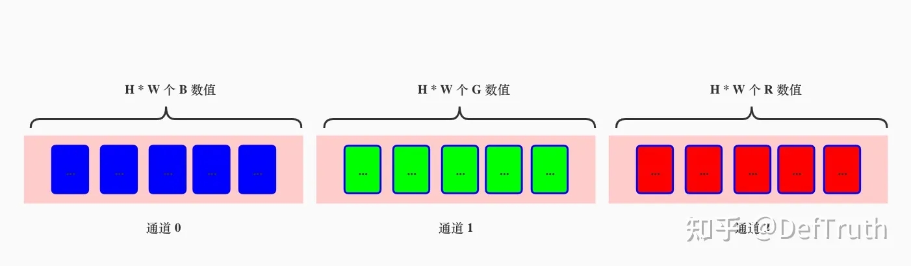
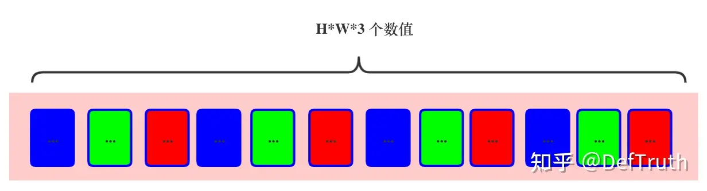

#[推理部署]🤓如何使用ONNXRuntime C++ API处理NCHW和NHWC输入？

#一、 前言
趁着端午假期，记录一下以往的笔记。还是那句话，好记性不如烂笔头，写点水文章，既是输出也是输入~

#二、 ONNXRuntime在数据前处理上与其他框架的一些区别
单说前处理这块，ONNXRuntime的C++ API并没有十分完善。我们知道MNN有MNN::CV模块，ncnn有from_pixels等丰富的预处理功能函数，TNN也可以在构造Mat的时候指定数据的转换格式。维度ONNXRuntime的C++接口，似乎并没有提供自带的数据处理接口，无论是NCHW，还是NHWC都需要手动处理好再输进去。如果需要经常使用ONNXRuntime的话，封装一个统一的接口会非常方便。这篇文章就简单记录下这个功能函数的实现，内容不多。

#三、 ONNXRuntime C++处理NCHW和NHWC输入
* 先定义一个函数签名
```c++
namespace ortcv
{
  // specific utils for ONNXRuntime
  namespace utils
  {
    namespace transform
    {
      enum
      {
        CHW = 0, HWC = 1
      };

      /**
       * @param mat CV:Mat with type 'CV_32FC3|2|1'
       * @param tensor_dims e.g {1,C,H,W} | {1,H,W,C}
       * @param memory_info It needs to be a global variable in a class
       * @param tensor_value_handler It needs to be a global variable in a class
       * @param data_format CHW | HWC
       * @return
       */
      LITE_EXPORTS Ort::Value create_tensor(const cv::Mat &mat, const std::vector<int64_t> &tensor_dims,
                                            const Ort::MemoryInfo &memory_info_handler,
                                            std::vector<float> &tensor_value_handler,
                                            unsigned int data_format = CHW) 
                                            throw(std::runtime_error);
     // ...
    }

  } // NAMESPACE UTILS
} // NAMESPACE ORTCV
```
先依赖cv::Mat来实现一个简单的。tensor_value_handler是一个持有实际数据的vector，ONNXRuntime在使用Ort::Value::CreateTensor<float>(...)创建新的Tensor时，不会实际去持有数据（或拷贝数据，如果我理解错的话，欢迎指正），只是持有对真实数据的引用，并记录在内存中线性布局的数据实际上如何映射到张量（Ort::Value）对应的维度的。所以如果你不是传入一个tensor_value_handler（变量名随意）来持有实际的数据的话，那么当退出这个自定义函数时，Ort::Value指定的实际数据已经被释放了，从而会引起内存访问错误。接下来看看NCHW和NHWC的处理是如何实现的（其实也很简单）

* create_tensor中处理NCHW和NHWC
```c++
//*************************************** ortcv::utils **********************************************//
Ort::Value ortcv::utils::transform::create_tensor(const cv::Mat &mat,
                                                  const std::vector<int64_t> &tensor_dims,
                                                  const Ort::MemoryInfo &memory_info_handler,
                                                  std::vector<float> &tensor_value_handler,
                                                  unsigned int data_format)
throw(std::runtime_error)
{
  const unsigned int rows = mat.rows;
  const unsigned int cols = mat.cols;
  const unsigned int channels = mat.channels();

  cv::Mat mat_ref;
  if (mat.type() != CV_32FC(channels)) mat.convertTo(mat_ref, CV_32FC(channels));
  else mat_ref = mat; // reference only. zero-time cost. support 1/2/3/... channels

  if (tensor_dims.size() != 4) throw std::runtime_error("dims mismatch.");
  if (tensor_dims.at(0) != 1) throw std::runtime_error("batch != 1");

  // CXHXW
  if (data_format == transform::CHW)
  {

    const unsigned int target_height = tensor_dims.at(2);
    const unsigned int target_width = tensor_dims.at(3);
    const unsigned int target_channel = tensor_dims.at(1);
    const unsigned int target_tensor_size = target_channel * target_height * target_width;
    if (target_channel != channels) throw std::runtime_error("channel mismatch.");

    tensor_value_handler.resize(target_tensor_size);

    cv::Mat resize_mat_ref;
    if (target_height != rows || target_width != cols)
      cv::resize(mat_ref, resize_mat_ref, cv::Size(target_width, target_height));
    else resize_mat_ref = mat_ref; // reference only. zero-time cost.

    std::vector<cv::Mat> mat_channels;
    cv::split(resize_mat_ref, mat_channels);
    // CXHXW
    for (unsigned int i = 0; i < channels; ++i)
      std::memcpy(tensor_value_handler.data() + i * (target_height * target_width),
                  mat_channels.at(i).data,target_height * target_width * sizeof(float));

    return Ort::Value::CreateTensor<float>(memory_info_handler, tensor_value_handler.data(),
                                           target_tensor_size, tensor_dims.data(),
                                           tensor_dims.size());
  }

  // HXWXC
  const unsigned int target_height = tensor_dims.at(1);
  const unsigned int target_width = tensor_dims.at(2);
  const unsigned int target_channel = tensor_dims.at(3);
  const unsigned int target_tensor_size = target_channel * target_height * target_width;
  if (target_channel != channels) throw std::runtime_error("channel mismatch!");
  tensor_value_handler.resize(target_tensor_size);

  cv::Mat resize_mat_ref;
  if (target_height != rows || target_width != cols)
    cv::resize(mat_ref, resize_mat_ref, cv::Size(target_width, target_height));
  else resize_mat_ref = mat_ref; // reference only. zero-time cost.

  std::memcpy(tensor_value_handler.data(), resize_mat_ref.data, target_tensor_size * sizeof(float));

  return Ort::Value::CreateTensor<float>(memory_info_handler, tensor_value_handler.data(),
                                         target_tensor_size, tensor_dims.data(),
                                         tensor_dims.size());
}
```
首先，需要明确一个用法，cv::Mat的赋值构造函数“=”是被重载的，它不实际拷贝右值的内容，而只是将左值指向已经存在的右值，这是一个O(1)复杂度的zero-copy操作。
```c++
 /** @brief assignment operators

    These are available assignment operators. Since they all are very different, make sure to read the
    operator parameters description.
    @param m Assigned, right-hand-side matrix. Matrix assignment is an O(1) operation. This means that
    no data is copied but the data is shared and the reference counter, if any, is incremented. Before
    assigning new data, the old data is de-referenced via Mat::release .
     */
    Mat& operator = (const Mat& m);
```
因此，当输入的cv::Mat和想要构造的张量在维度上一致时，以下这个操作应该是没有什么耗时的。
```c++
resize_mat_ref = mat_ref; // reference only. zero-time cost.
```
但是，维度不一致时，就需要重新resize，cv::resize当然会产生新的结果，也会需要一定的耗时。但这时产生的结果的作用域是函数作用域，退出这个函数后它就没了。这个就是上面说需要传入一个tensor_value_handler来持有数据的原因之一。另外就是，tensor_value_handler可以先根据计算出来的target_tensor_size分配固定大小的内存，这样可以避免多次自动分配内存（不过实际上这里并没有用到push_back等接口）
```c++
tensor_value_handler.resize(target_tensor_size);
```
接下来看看，NCHW和NHWC的数据是如何处理的。
* NCHW输入格式处理
```c++
std::vector<cv::Mat> mat_channels;
    cv::split(resize_mat_ref, mat_channels);
    // CXHXW
    for (unsigned int i = 0; i < channels; ++i)
      std::memcpy(tensor_value_handler.data() + i * (target_height * target_width),
                  mat_channels.at(i).data,target_height * target_width * sizeof(float));
```

因此输入的cv::Mat需要先转换成这种内存布局，cv::Mat中的数据内存布局是HXWXC，如下所示：


当然，使用cv::split()来处理，不一定是最高效的，它可能会导致新的内存分配。我们也可以直接通过指针计算对应的内存位置的方式来把cv::Mat转换成CHW的数据分布，这个留到后面再改进一下吧。
```c++
/** @overload
@param m input multi-channel array.
@param mv output vector of arrays; the arrays themselves are reallocated, if needed.
*/
CV_EXPORTS_W void split(InputArray m, OutputArrayOfArrays mv);
```
---

* NHWC输入格式处理
NHWC输入格式的处理就简单多了，因为cv::Mat本身就是HWC的格式，因此不需要进行额外的数据重排，直接将数据拷贝过去即可。
```c++
std::memcpy(tensor_value_handler.data(), resize_mat_ref.data, target_tensor_size * sizeof(float));
```

#四、 NCHW和NHWC的实际使用示例
* 使用ortcv::utils::transform::create_tensor处理NCHW输入
```c++
Ort::Value transform(const cv::Mat &mat_rs)
{
  cv::Mat canvas;
  cv::cvtColor(mat_rs, canvas, cv::COLOR_BGR2RGB);
  ortcv::utils::transform::normalize_inplace(canvas, mean_vals, scale_vals); // float32
  return ortcv::utils::transform::create_tensor(
      canvas, input_node_dims, memory_info_handler,
      input_values_handler, ortcv::utils::transform::CHW);
}
```
* 使用ortcv::utils::transform::create_tensor处理NHWC输入
```c++
Ort::Value transform(const cv::Mat &mat_rs)
{
  cv::Mat canvas;
  cv::cvtColor(mat_rs, canvas, cv::COLOR_BGR2RGB);
  // (1,192,192,3) 1xHXWXC
  ortcv::utils::transform::normalize_inplace(canvas, mean_val, scale_val); // float32
  return ortcv::utils::transform::create_tensor(
      canvas, input_node_dims, memory_info_handler,
      input_values_handler, ortcv::utils::transform::HWC);
}
```