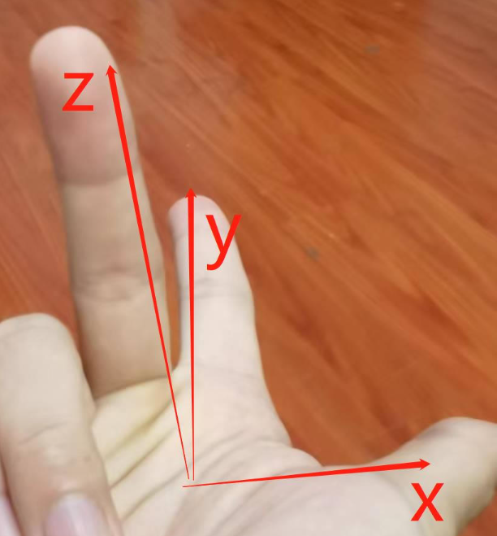
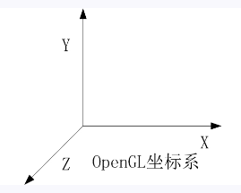

# 旋转矩阵左乘右乘理解

## 1. 向量与旋转矩阵相乘
在线性代数中，旋转矩阵是用来描述平面或空间中的旋转变换的矩阵。左乘和右乘旋转矩阵的区别在于乘法的顺序和作用对象。

左乘旋转矩阵：
当一个向量左乘一个旋转矩阵时，旋转矩阵位于向量的左侧。这意味着旋转先作用于向量，然后才是其他可能的变换。左乘旋转矩阵实际上是将向量应用于旋转，然后将结果用于其他变换。

例如，假设有一个旋转矩阵 R 和一个向量 v，则左乘旋转矩阵的结果表示为 Rv。这意味着向量 v 先被旋转，然后才应用其他可能的变换。

右乘旋转矩阵：
当一个向量右乘一个旋转矩阵时，旋转矩阵位于向量的右侧。这意味着向量先应用于其他可能的变换，然后再应用旋转。右乘旋转矩阵实际上是将向量先用于其他变换，然后再进行旋转。

例如，假设有一个旋转矩阵 R 和一个向量 v，则右乘旋转矩阵的结果表示为 vR。这意味着向量 v 先应用于其他变换，然后再被旋转。

## 2. 两个旋转矩阵相乘
两个旋转矩阵之间的左乘和右乘也会导致不同的结果。假设有两个旋转矩阵 R1 和 R2。

左乘旋转矩阵：
当一个旋转矩阵左乘另一个旋转矩阵时，旋转矩阵位于被乘矩阵的左侧。这意味着第一个旋转先应用于向量，然后再应用第二个旋转。这通常用于描述连续的旋转变换。

例如，假设有一个向量 v，左乘旋转矩阵的结果表示为 R1R2v。这意味着向量 v 先应用于旋转矩阵 R2，然后再应用于旋转矩阵 R1。

右乘旋转矩阵：
当一个旋转矩阵右乘另一个旋转矩阵时，旋转矩阵位于被乘矩阵的右侧。这意味着第二个旋转先应用于向量，然后再应用第一个旋转。这通常用于描述不同坐标系中的旋转变换。

例如，假设有一个向量 v，右乘旋转矩阵的结果表示为 vR1R2。这意味着向量 v 先应用于旋转矩阵 R2，然后再应用于旋转矩阵 R1。

## 3. 为什么一个旋转矩阵绕x轴旋转90度要右乘
在数学中，通常情况下，"绕 x 轴旋转 90 度再转置" 这个操作意味着对一个矩阵进行顺时针旋转 90 度，然后对结果进行转置操作。

具体来说，如果你有一个矩阵 A，绕 x 轴旋转 90 度再转置的操作可以表示为 \( (A \cdot R_{x})^{T} \)，其中 \( R_{x} \) 是绕 x 轴旋转 90 度的旋转矩阵。

绕 x 轴旋转 90 度的旋转矩阵 \( R_{x} \) 如下所示：

\[
R_{x} = \begin{pmatrix}
1 & 0 & 0 \\
0 & 0 & -1 \\
0 & 1 & 0 \\
\end{pmatrix}
\]

因此，\( A \cdot R_{x} \) 表示将矩阵 A 绕 x 轴旋转 90 度。然后，对结果进行转置，相当于将结果矩阵的行和列进行互换。

这样的操作在三维空间中可能表示对一个坐标系下的向量或者物体进行旋转，并且将结果映射到另一个坐标系中。

在欧几里得空间中，旋转矩阵的乘法顺序通常是先应用最后面的矩阵，然后再依次向左应用前面的矩阵。这与向量转换的顺序相对应，即先应用最右边的变换，然后是其余的变换。

假设有一个向量 v，要将其绕 x 轴顺时针旋转 90 度，那么我们需要右乘旋转矩阵。这是因为我们希望先将向量 v 应用于绕 x 轴的旋转变换，然后再进行其他变换。右乘旋转矩阵实现了这一点。

换句话说，右乘旋转矩阵表示向量 v 先应用于绕 x 轴的旋转变换，然后再进行其他可能的变换，这与在三维空间中通常的使用方式相对应。

## 4. 全景和点云融合坐标系总结
点云的世界坐标系是z轴朝上的右手系
<div align=center>
</div>

osg最终显示的坐标系是x轴朝右，y轴朝上，z轴朝外。点云要在osg里和全景图套合显示，点云要先转成y轴朝上，即x轴转90°。

相机在世界坐标系下的位姿是跟激光和imu联合标定的，传入的姿态角是rph格式，rph转opk的代码是
```c++
void rotationhelper::convertRPH2OPKPano(double roll, double pitch, double yaw, double& ommega, double& phi, double& kappa)
{
	//double M_PI = 3.1415926535;
	cv::Vec3f rph(roll, pitch, yaw);
	cv::Mat R = eulerAnglesToRotationMatrix(rph);
	cv::Mat R_x33 = (cv::Mat_<double>(3, 3) <<0
		1, 0, 0,
		0, cos(M_PI), sin(M_PI),
		0, -sin(M_PI), cos(M_PI)
		);

	ommega = asin(-R.at<double>(1, 2));
	kappa = atan2(R.at<double>(1, 0), R.at<double>(1, 1));
	phi = atan2(-R.at<double>(0, 2), R.at<double>(2, 2));
}
```
再由opk转旋转矩阵，代码是
```c++
void rotationhelper::gPOK2RMtx(double phi, double omg, double kap, double * R, double * dc)
{
	double   sPhi, cPhi, sOmg, cOmg, sKap, cKap;  /* angles in rad */

	sPhi = sin(phi);
	cPhi = cos(phi);
	sOmg = sin(omg);
	cOmg = cos(omg);
	sKap = sin(kap);
	cKap = cos(kap);

	R[0] = cPhi * cKap - sPhi * sOmg * sKap;
	R[1] = -cPhi * sKap - sPhi * sOmg * cKap;
	R[2] = -sPhi * cOmg;
	R[3] = cOmg * sKap;
	R[4] = cOmg * cKap;
	R[5] = -sOmg;
	R[6] = sPhi * cKap + cPhi * sOmg * sKap;
	R[7] = -sPhi * sKap + cPhi * sOmg * cKap;
	R[8] = cPhi * cOmg;

	if (dc) {
		dc[0] = sOmg;
		dc[1] = cOmg;
		dc[2] = sPhi;
		dc[3] = cPhi;
		dc[4] = sKap;
		dc[5] = cKap;
	}

	return;
}
```
这样就能计算出点云转到相机坐标系的矩阵$ R_c $，设绕x轴旋转90°的旋转矩阵是$R_x$，世界坐标系下点云到相机的旋转矩阵$R_{w2c}$即为
$$R_{w2c} = R_c \cdot R_x$$

## 5. 点云与