# 1 球面透视投影与展开


&emsp;&emsp;鱼眼镜头的成像通常首先要进行球面透视投影，即将三维空间中的点沿着经过镜头光学中心的直线投影到以光心为原点的单位半径球体 内表面 上，从而球面上的每一个点，可通过相应的经纬度来表示。如图 1 所示，以镜头光学中心为原点建立三维直角坐标系，其中$ X Y Z $ 轴满足右手定则。通常令 $Y $轴与镜头光轴重合，并指向相机外部；$Z$ 轴指向镜头顶部；$X $ 轴指向镜头右侧。那么空间中任意一点$ P $ 沿着直线 $O P$  投影到单位球面上的点$P_1$ 的经度（longitude）可表示为直线 $O P$  投影到 $X O Y $平面上的直线与$ Y $轴的夹角，常用符号 $θ $ 表示，其中位于 $Y $ 轴左侧的称为西经，$− π ≤ θ ≤ 0 $，位于右侧的称为东经，$0 ≤ θ ≤ π$ 。点 $P_1$的纬度（latitude）可表示为直线  $O P$ 与  $X O Y $平面的夹角，常用符号 $φ $ 表示，其中位于  $X O Y $ 平面上方的称为北纬，$0 ≤ φ ≤ π / 2$，位于下方的称为南纬，$− π / 2 ≤ φ ≤ 0$。不同的系统可能会采用不同的坐标轴方向定义，但通常需要满足右手定则，例如在开源软件 Hugin 中，其坐标系方向为图 1 坐标系绕 $X $轴逆时针（脸朝$X $轴负方向）旋转了 90 度，即$Z $ 轴与光轴重合并指向相机内部，$Y $轴则指向镜头顶部；对于经纬度的定义也可能与上述存在少许差异，但基本原理类似，不再赘述。因为我们基本没法做出一个球面的成像传感器，所以对于投影到球面上的点，可根据一定的鱼眼投影模型进一步投影到成像平面得到相应的鱼眼图像。因此，鱼眼图像的矫正过程实际上就是找出球面上每个经纬度对应的鱼眼图像坐标，从而可以通过插值获得该经纬度的像素信息，然后将球面展开为所需要的平面图像。
<p align="center">
  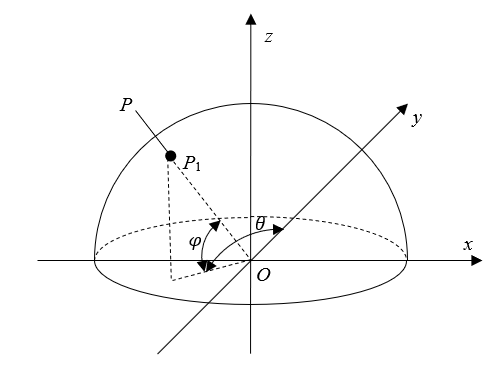
</p>

<center>图1 球面透视投影模型 </center>

 &emsp;&emsp;球面的展开通常基于等矩形（equirectangular）也叫等距圆柱投影模型，即将球面展开为矩形网格，其中网格的大小与相应的经度与纬度区间大小成正比，如图2所示。如果是基于圆柱（cylindric）投影的话垂直方向的坐标实际上表示的是纬度的正切值，这时只需要将其换算回弧度即可，不过要注意由于正切的原因纬度是不能接近 $ π / 2 $ 的，剩余的矫正过程与等矩形投影完全一致。由于球面展开后水平视场（Field of View, FOV）为 $2 π $，而垂直视场为 $π$ ，所以全景图像的横竖比例通常为 2:1，但也可以根据需要进行裁剪。假设其宽度为 $W$ ，高度为 &H& ，以 $ (x, y)$ 代表从图像 左下角 起水平第 $x$  个，垂直第 $y $ 个像素，则其经纬度可表示为

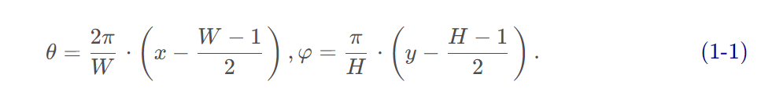
                        
 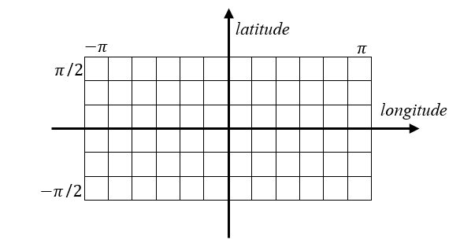  
 <center>图2 球面的等距投影</center>     

#2 鱼眼投影成像模型
 &emsp;&emsp;球面上的点通过鱼眼镜头投影到相机成像平面得到鱼眼图像的过程通常基于光线折射的原理，即光线进入鱼眼镜头后会发生折射，且在成像平面上的落点和光轴之间的距离 $r$  与入射光线和光轴的夹角即入射角 $θ$  相关，落点处在入射光线与光轴所组成的平面上。不同的函数关系 $r = f ( θ )$  对应了不同的鱼眼投影模型。图 3 展示了几种比较经典的 鱼眼投影模型，其对应名称如表 1 所示。
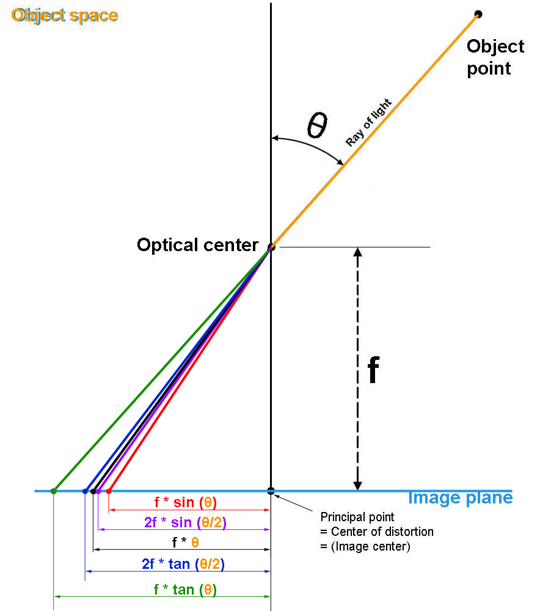
<center>图3 经典鱼眼投影模型</center>

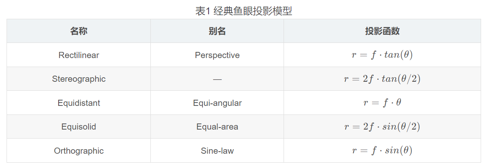

&emsp;&emsp;直线投影（Rectilinear）或者说透视投影（Perspective）相当于小孔成像，三维空间中的直线投影到鱼眼图像中同样是一条直线。虽然该直线首先被投影在球面上看上去是一条曲线，但由于 tan ⁡ \tantan 函数的原因，在最终的鱼眼图像上，我们又重新得到了一条平面直线，因此我们可以认为这种投影并没有产生畸变。然而，从其投影函数可以看出，当入射角趋近于 90 度时，其在图像平面上的落点将趋近于无穷远，所以不能作为超广角镜头的投影模型。从名字可以看出，等距投影（Equidistant）或者说等角投影（Equiangular）中落点到光轴的距离与入射角成线性正比例关系，从而相同的角差对应相同的距差，类似于图 2 中球面的等矩形展开。由于其投影函数比较简单，而且在接近光轴位置的图像畸变较小，同时能够在有限且较小的图像平面上的反映入射角大于 90 度的空间点，所以在鱼眼成像分析以及实际生产中比较常用。当鱼眼镜头的视场 $F O V$  以及对应的图像半径 $R$  确定时，对于等距投影模型，我们可以得到其等效焦距 $f = 2 R / F O V$ 。
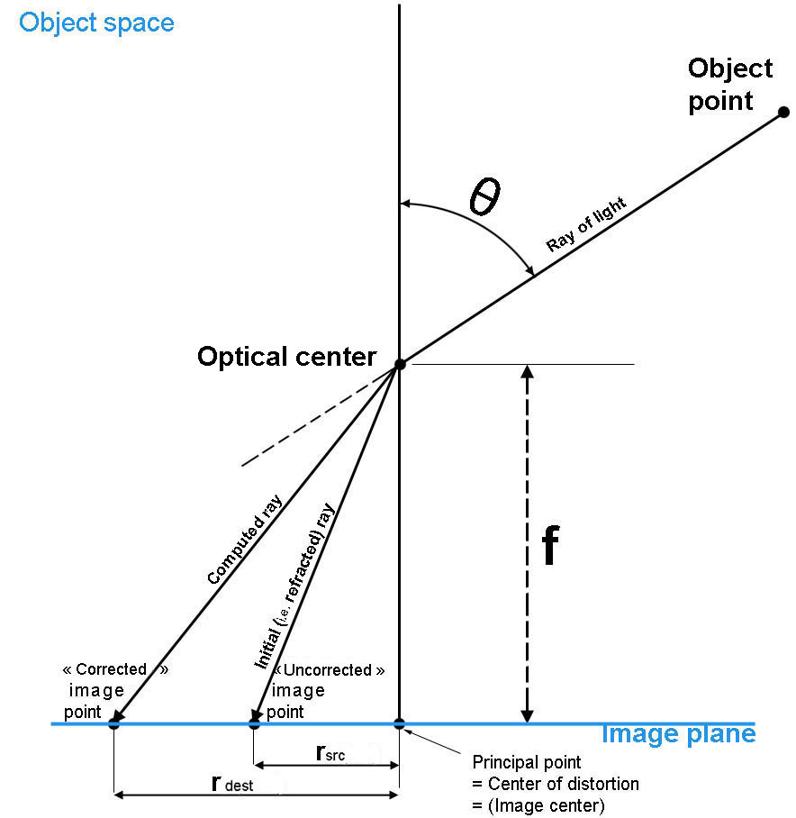
<center>图4 鱼眼镜头参数校正示意图</center>

&emsp;&emsp;实际上，表 1 中所提到的几种投影模型属于比较简单的近似，由于生产环境以及生产工艺的限制，实际的投影函数可能与上述的理想函数存在偏差，从而导致计算的落点与实际的落点出现偏差，如 图4 所示，其中 $r_{src}$对应原始即实际的落点距离，$r_{dest}$对应表 1 中理想即近似计算的落点距离。一般来说这种偏差只是对于落点距离 $r $ 而言（径向畸变），而不会对共面性造成破坏（切向畸变）。对于高端的鱼眼镜头，其厂商通常会提供相应 $r-\theta$ 曲线，从而可以用高阶的多项式进行拟合，称为镜头校正函数，相应的多项式系数称为镜头校正参数。校正函数的形式并不固定，不同的系统可能使用不同的多项式阶数以及自变量和因变量。一种常用的校正函数形式是以 $r$  作为自变量，$\theta$ 作为因变量，即
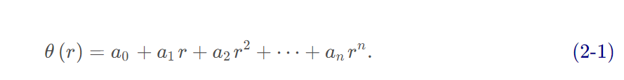

&emsp;&emsp;由于通常假设鱼眼具有径向对称性，因此零阶项取 0，基本上采用 4 阶的多项式即可拟合大部分的镜头校正曲线。但是，在鱼眼图像矫正过程中，通常是从目标即如图 2 中的全景图像坐标倒推到鱼眼图像坐标，因此所需要的其实是上述镜头校正函数的反函数，然而获取反函数并不是一件易事。所以，PanoTools 工具库使用了一种 4 阶的从理想落点距离 $r_{dest}$ 到实际落点距离 $r_{src}$ 的多项式拟合函数，即
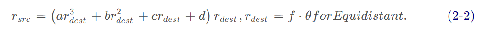

对于一个理想的基于等距投影模型的鱼眼镜头，有 a = b = c = 0 , d = 1 。由于校正后的落点可能超出鱼眼图像的尺寸范围，因此在某些应用中为了保持相同的尺寸，需要令 d = 1 − ( a + b + c ) ，注意这时 r 已被归一化。

#3 鱼眼图像矫正
&emsp;&emsp;有了前述的铺垫，我们可以很容易地推导目标全景图像到鱼眼图像的坐标映射关系。对于全景图像上的任意一个像素点 ( m , n ) ，由式（1-1）可得到单位球面上相应的经度 θ  和纬度 φ ，那么球面上相应的三维直角坐标为
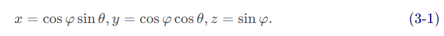

&emsp;&emsp;在前述内容中，我们知道 Y  轴对应了鱼眼镜头的光轴并指向镜头前方，为了便于理解，将图 1 的坐标系绕着 X  轴逆时针旋转 90 度（注意这只是转换视角，Y  轴还是与光轴重合），如图 5 所示。假设鱼眼图像的中心在镜头光轴延长线上，根据鱼眼的折射模型，可以得到球面上点 P PP 在鱼眼图像平面上的投影点 $P_1$ ，其中 $P_1$ 到图像中心的距离为 r 。由于此时鱼眼图像与实际拍摄物体发生了 180 度旋转，因此不妨令点 P 在鱼眼图像上的投影点为 $P_2$，其在鱼眼图像上的位置如图 6 所示，这里假设该鱼眼图像为正方形，边长为 $W_f$，有效投影区域为相应的内切圆，即未被裁剪。实际上，内切圆外部的四个角也可认为是鱼眼图像的一部分，只是对应更大的入射角。令入射角为 $\varphi_f$ ，其取值范围为 $[0, \pi]$。可以看出鱼眼镜头最大入射角的两倍即是该鱼眼镜头的有效视场 $FOV_f$ 。令 $P_2$ 相对于 X XX 轴正半轴的偏转角为 $\theta_f$，其取值范围为 [−π,π]。
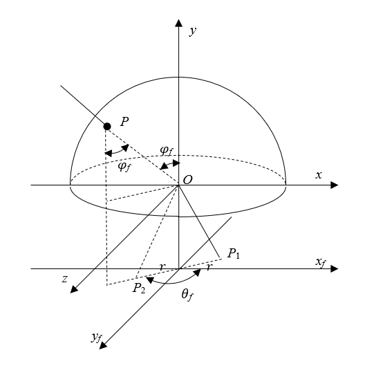
<center>图5 鱼眼投影示意图</center>

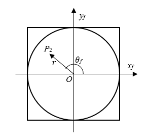
<center>图6 鱼眼图像点坐标示意图</center>

由图5容易可求得
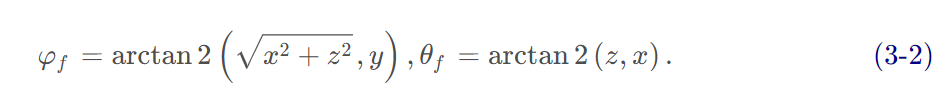

根据等距投影模型，$P_2$点在鱼眼图像上与图像中心的距离 $ r=f \cdot \varphi_f$ ，其中 f  称为鱼眼镜头的等效焦距。由于 r  的最大值对应于入射角的最大值，因此可得
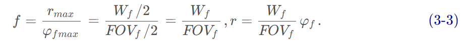

那么可求得 $P_2$相对于鱼眼图像中心的坐标为
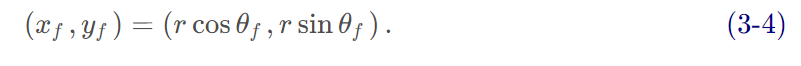

由式（3-4）通过如双线性或者双三次等插值算法即可得到目标全景图相应像素点对应的经纬度的像素值。对于较低分辨率的目标全景图还可以采用超采样方法即先将目标全景图放大一定倍数进行坐标映射然后再缩小回原来的尺寸，从而在一定程度上减少边缘锯齿现象。

&emsp;&emsp;通过前面的分析可以看到，对于同一张如图 6 所示的鱼眼图像，采用不同的有效视场（即内切圆对应视场）参数  $FOV_f$ ，得到的全景矫正图像是不一样的。图 7 展示了一些 例子，其中红色边缘对应图 6 的正方形边框，蓝色边缘对应了其内切圆即有效投影区域。当视场小于 180 度时，我们无法看到两极以及背后的景物，因此全景图的上下左右边缘部分都是空白的；而当视场刚好为 180 度时，我们刚好能够看到一半的球面，包括两个极点，这时内切圆被矫正为一个正方形；而当视场大于180度时，我们不仅能看到两极，还能看到靠近两极的背面部分，即这部分展开后的水平视场可以大于 180 度甚至达到 360 度，类似于地球两极的极昼现象，视场越大，能够看到的背面部分就越多。由于实际生产中制造 360 度视场的鱼眼镜头几乎是不可能的，所以单个鱼眼镜头矫正后是不能填满整张全景图的，因此可通过朝着多个方向拍摄多张鱼眼图像矫正后通过重叠区的匹配再拼接成一张完整的 360 度全景图。
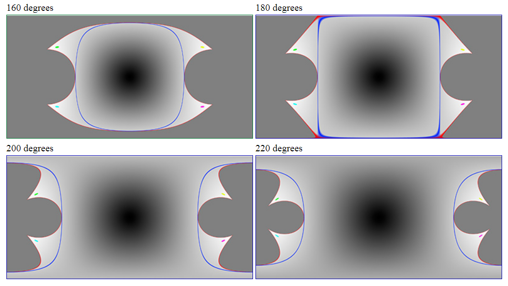
<center>图7 不同鱼眼镜头视场参数的矫正效果</center>

#4 镜头偏航、俯仰与旋转处理
在前面的分析中，目标全景图即图 2 是以图 1 所示的直角坐标系为参考的，其 Y  轴指向了全景图像的中心，也就是我们所期望拍摄的方向，而鱼眼图像即图 6 是以图 5 所示的直角坐标系为参考的，其以鱼眼镜头为基准，Y  轴实际上与镜头的光轴重合，并指向镜头的正前方，也就是相机实际拍摄的方向。一般情况下，暂不考虑坐标原点即镜头光心的平移，相机实际拍摄的方向就是我们所期望拍摄的方向，所以图 5 的直角坐标系相和图 1 的直角坐标系是重合的。然而，当两者方向不一致时，坐标系发生了偏转，因此通过式（3-1）求得的三维直角坐标并不能直接用于式（3-2）的求解，因为两者对应了不同的空间点，从而会导致坐标映射出现错误。因此，需要将式（3-1）求得的以图 1 坐标系为参考的直角坐标变换到以图 5 坐标系为参考的空间中。

镜头相对于目标拍摄方向的偏转可通过三个角度参数定义，即 偏航角（yaw）、俯仰角（pitch）和旋转角（roll），其定义如图 8 所示，其中 Y  轴与镜头光轴重合并指向镜头前方。偏航角反映光轴的水平偏离程度，即绕着 Z  轴旋转，可定义向左为正角度。偏航只会改变经度而不会改变纬度，因此其基于等矩形投影展开得到的全景图像的垂直可视区间不会发生改变，而水平可视区间则只是平移，所以偏航处理也是最简单的，除了通过常规的仿射变换得到图 5 参考系的坐标，也可以直接按照无偏航处理，最后将矫正后的全景图按照偏航的方向和角度进行相应的像素平移即可，如图 9 右上角图所示。通常 360 度全景拼接就是采用两个有效视场大于 180 度的鱼眼镜头分别在偏航为 0 和 180 度的方向各拍摄一张鱼眼图像，从而得到足够重叠区域以进行后续的融合操作。

5 鱼眼矫正示例
&emsp;&emsp;以上介绍了鱼眼图像到全景图像的基本矫正原理，在实际应用中，我们其实还有很多问题需要解决。例如，通常两个鱼眼的光心不在同一点上，这时就会导致视差的出现，那我们应该怎么去解决？另外就是我们以上讨论了那么多参数，但这些参数又怎么求解？这些都需要进一步的讨论。但是，基于以上原理，给定一张鱼眼图像，以及相应的如视场、偏航等等参数，我们至少可以得到该鱼眼图像在目标全景图像上的基本效果了。以下提供了简单的基于 Python 的鱼眼矫正实现，以及相应的示例。注意，因为 Python 是解释性语言，处理循环通常比较低效，而我们需要对目标全景图上的每一个像素进行插值以获得相应的像素值，这个过程需要比较长的时间，所以目标全景图的尺寸不要设置得太高，基本 400x200 都需要十几秒。

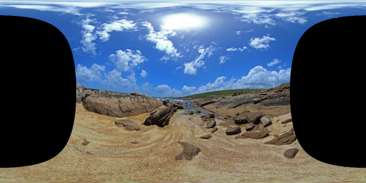
```python
# -*- coding: utf-8 -*-

from __future__ import print_function, division
import numpy as np
import cv2
from scipy.interpolate import interp2d

""" ------------------ parameters ----------------- """

src = cv2.imread('exampleleft.jpg', -1) / 255.     # source fisheye image
h, w, c = src.shape

rx, ry = 1024., 1024.               # center of the fisheye circle, (0, 0) for bottom left corner
R = 1024.                           # radius of the fisheye circle

fov = 210 * np.pi / 180.            # field of view of the fishye circle
W, H = 600, 300                     # size of the output panorama

interp_method = 'cubic'             # must in ['linear', 'cubic', 'quintic']
upsample = 2                        # factor of super-sampling anti-aliasing

yaw, pitch, roll = 0, 0, 0          # degree 


""" ----------------- processing -------------------- """

up_W, up_H = W *upsample, H * upsample

yaw = yaw * np.pi / 180.              # rotate around z, angle from x+ to y+
yaw_m = np.array([[np.cos(-yaw), -np.sin(-yaw), 0], [np.sin(-yaw), np.cos(-yaw), 0], [0, 0, 1]])

pitch = pitch * np.pi / 180.          # rotate around x, angle from y+ to z+
pitch_m = np.array([[1, 0, 0], [0, np.cos(-pitch), -np.sin(-pitch)], [0, np.sin(-pitch), np.cos(-pitch)]])

roll = roll * np.pi / 180.            # rotate around y, angle from x+ to z+
roll_m = np.array([[np.cos(-roll), 0, -np.sin(-roll)], [0, 1, 0], [np.sin(-roll), 0, np.cos(-roll)]])

affine_m = yaw_m.dot(pitch_m).dot(roll_m)

# by default, the horizontal FOV is [-pi, pi], the verticle FOV is [-pi/2, pi/2]
phi   = np.linspace(1, -1, up_H, endpoint=False) * np.pi * 0.5   # latitude of the equirectangular
theta = np.linspace(-1, 1, up_W, endpoint=False) * np.pi         # longitude of the equirectangular

theta, phi = np.meshgrid(theta, phi)

x = np.cos(phi) * np.sin(theta)     # 3D space x
y = np.cos(phi) * np.cos(theta)     # 3D space y
z = np.sin(phi)                     # 3D space z

# yaw, pitch, roll inverse affine tranformation
xyz = np.vstack([mat.reshape(-1) for mat in [x, y, z]])
no_rpy_xyz = affine_m.dot(xyz)

x, y, z = [coord.reshape([up_H, up_W]) for coord in no_rpy_xyz]

phi_f   = np.arctan2(np.sqrt(x*x + z*z), (y + 1e-12))     # incident angle of the fisheye
theta_f = np.arctan2(z, (x + 1e-12))                      # projection angle of the fisheye plane

r_f = phi_f * 2 * R / fov          # equidistant model, where r = C * theta
x_f = rx + r_f * np.cos(theta_f)   # x coordinate on the fisheye plane
y_f = ry + r_f * np.sin(theta_f)   # y coordinate on the fisheye plane
    
dst = np.zeros([up_H, up_W, c])
for i in range(c):
    interp = interp2d(np.arange(w), np.arange(h)[::-1], src[:, :, i], interp_method, fill_value=0)
    for j in range(up_H):
        for k in range(up_W):
            if (x_f[j, k] < w and y_f[j, k] < h):
                dst[j, k, i] = interp(x_f[j, k], y_f[j, k])
                
dst = (np.clip(dst, 0, 1) * 255).astype('uint8')
if upsample > 1:
    dst = cv2.resize(dst, (W, H), cv2.INTER_CUBIC)
cv2.imwrite('panorama.png', dst)


```

原文链接：https://blog.csdn.net/qq_33552519/article/details/107362517